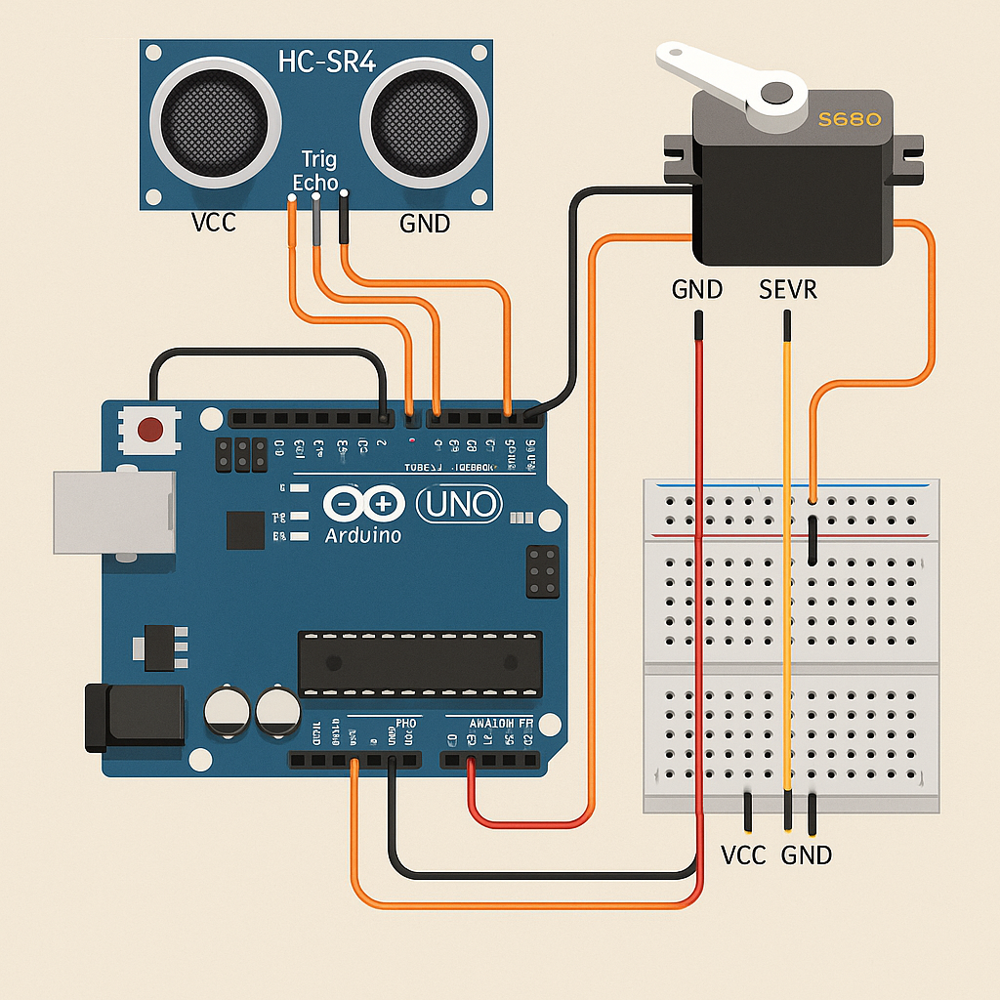

# 📡 Radar System using Arduino and Processing

A simple radar-like scanner using an ultrasonic sensor mounted on a servo. The Arduino sweeps 0–180° and streams distance data via serial. A Processing sketch visualizes the scan in real time.

---

## 🔧 Hardware
- Arduino UNO
- HC-SR04 Ultrasonic Sensor (Trig/Echo)
- SG90/MG90S Servo
- Jumper wires, optional breadboard
- (Recommended) External 5V for servo + **common ground** with Arduino

### 📌 Wiring
- **Servo**: Signal → D11, Vcc → 5V, GND → GND
- **HC-SR04**: TRIG → D9, ECHO → D10, Vcc → 5V, GND → GND

---

## 💻 Software
- Arduino IDE (upload `Code/Arduino/radar.ino`)
- Processing IDE (run `Code/Processing/radar_visualization.pde`)

---

## 🔌 Serial Protocol
Arduino prints lines in the form:
